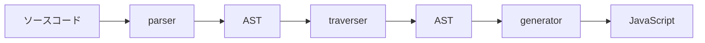
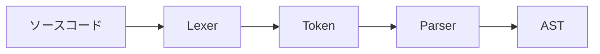

## はじめに

### 自己紹介

Sun*のFrontend Developerのおふじです。
業務ではリードエンジニアとして、開発を行っています。
最近では主にReactとTypeScriptを使ったWebアプリケーションの開発を行うことが多いです。

個人では、Rustが好きで簡単なアプリケーションを作るなりして楽しんでいます。
実は今回の記事もその一環になります。

### この記事の目的

本記事は、[Sun* Advent Calendar2023](https://adventar.org/calendars/9043)の19日目の記事となります。

今回の記事では、SWCというJavaScriptのトランスパイラを使ってカスタムプラグインを作成することで、JavaScriptのトランスパイルの仕組みに触れることを目的としています。

### この記事の構成

この記事は以下の内容で構成されます。

1. **はじめに**
2. SWCとは
3. JavaScriptのトランスパイルについて
4. ASTについて
5. SWCのカスタムプラグインを作成してみる
6. まとめ
7. 参考文献

## SWCとは

SWCとは、Rustで書かれたJavaScript/TypeScriptのトランスパイラです。
同等の機能を持つBabelと比較して、高速であることが特徴です。

> SWC is 20x faster than Babel on a single thread and 70x faster on four cores.

(シングルスレッド上でBabelの20倍早いとかなんとか)

https://swc.rs/

身近なところでは、Next.jsのコンパイラとして採用されています。
https://nextjs.org/docs/architecture/nextjs-compiler

主に機能としては、CompilationやMinification、Bundling等があります。

## JavaScriptのトランスパイルについて

普段私たちが利用しているTypeScriptやJSXはJavaScriptのエンジンでそのまま実行はできません。
なので実行できる形に（つまりJavaScriptに変換）してあげる必要があります。

:::message
トランスパイル(トランスコンパイル)とは

フリー百科事典『ウィキペディア（Wikipedia）』https://ja.wikipedia.org/wiki/%E3%83%88%E3%83%A9%E3%83%B3%E3%82%B9%E3%82%B3%E3%83%B3%E3%83%91%E3%82%A4%E3%83%A9)
> あるプログラミング言語で書かれたプログラムのソースコードを入力として受け取り、別のプログラミング言語の同等のコードを目的コードとして生成する、ある種のコンパイラである
:::

トランスパイルのライフサイクルについては以下のようになっています。


トランスパイルの処理の中ではAST(Abstract Syntax Tree)というデータ構造を中間表現として利用し、ソースコードを解析していきます。
※ASTについては後述します。

### parser
図のごとく、ソースコードをASTに変換する処理です。
ここではソースコードをNodeと呼ばれる単位に分割し、それぞれ意味のある形として構造化していきます。
こちらのフェーズについても詳細に書くと、下図のようなフローがあるのですが詳しい内容は割愛します。



もしご興味があれば、以下の記事が参考になります。
https://oxc-project.github.io/javascript-parser-in-rust/docs/overview

### traverser
このフェーズでは生成されたASTに対し、再帰的に解析を行います。
その過程で、ASTのノードに対して処理を行うことができます。
swcやbabelでは、このフェーズでノードに対して処理をするカスタムプラグインを作成することができます。
前述したJsx等をJavaScriptに変換する処理もこのフェーズで行われています。

例）
React Jsxを変換するpluginとしては以下のような物が利用されています。
https://babeljs.io/docs/babel-plugin-transform-react-jsx

### generator
最後に、ASTをJavaScriptに変換する処理です。
このフェーズでは、ASTを再帰的に解析し、JavaScriptのソースコードを生成します。


## ASTについて

Abstract Syntax Treeの略で、抽象構文木とも呼ばれます。
ソースコードの文法を抽象的に表現し、階層的に構造化したデータ構造です。
ASTは、Nodeという単位で構成されてます。
例えば以下のようなソースコードがあった場合、ASTはこのようになります。

```JavaScript
function hoge () {
    const huga = 'huga';
    console.log(huga);
}
```

```AST
{
  "type": "Program",
  "start": 0,
  "end": 65,
  "body": [
    {
      "type": "FunctionDeclaration",
      "start": 0,
      "end": 65,
      "id": {
        "type": "Identifier",
        "start": 9,
        "end": 13,
        "name": "hoge"
      },
      "expression": false,
      "generator": false,
      "async": false,
      "params": [],
      "body": {
        "type": "BlockStatement",
        "start": 17,
        "end": 65,
        "body": [
          {
            "type": "VariableDeclaration",
            "start": 20,
            "end": 40,
            "declarations": [
              {
                "type": "VariableDeclarator",
                "start": 26,
                "end": 39,
                "id": {
                  "type": "Identifier",
                  "start": 26,
                  "end": 30,
                  "name": "huga"
                },
                "init": {
                  "type": "Literal",
                  "start": 33,
                  "end": 39,
                  "value": "huga",
                  "raw": "'huga'"
                }
              }
            ],
            "kind": "const"
          },
          {
            "type": "ExpressionStatement",
            "start": 45,
            "end": 63,
            "expression": {
              "type": "CallExpression",
              "start": 45,
              "end": 62,
              "callee": {
                "type": "MemberExpression",
                "start": 45,
                "end": 56,
                "object": {
                  "type": "Identifier",
                  "start": 45,
                  "end": 52,
                  "name": "console"
                },
                "property": {
                  "type": "Identifier",
                  "start": 53,
                  "end": 56,
                  "name": "log"
                },
                "computed": false,
                "optional": false
              },
              "arguments": [
                {
                  "type": "Identifier",
                  "start": 57,
                  "end": 61,
                  "name": "huga"
                }
              ],
              "optional": false
            }
          }
        ]
      }
    }
  ],
  "sourceType": "module"
}
```

諸々説明が必要かと思いますが、
まず初めにJavaScriptではESTreeというMozillaが策定したASTの仕様が基礎になっています。

https://github.com/estree/estree

特徴としては、トップレベルのNodeであるProgramがsourceTypeというプロパティを持っており、その値がmoduleの場合はES Module、scriptの場合はScriptということを表しています。
上記例では、moduleとなっているのでES Moduleであることがわかります。

:::message
JavaScript ASTにはBabel/Babylon(Acorn系)やEsprima系等複数の種類が存在しているのですが、こちらについては割愛します。
:::

今回作成するpluginはSWCのpluginであるわけですが、SWCで採用しているASTは独自で定義したものを利用しておりESTreeとは異なります。
もし興味があれば、以下のリンクのページで試すことができます。

https://play.swc.rs/

さて少し話がそれましたが、まだ説明できていないNodeがありますね。
上述したProgramの他にもStatementやExpression、Declarations、Identifier、Literal等様々なNodeが存在します。

大体ここにまとまっていますので、こちらも興味があれば見てみてください。
https://github.com/estree/estree/blob/master/es5.md


### Statement
文を表すNodeです。
BlockStatementであれば、{}で囲まれた部分を表します。

### Expression
式を表すNodeです。
上記例では、CallExpressionやMemberExpressionが該当します。

### Declarations
変数宣言を表すNodeです。
上記例では、FunctionDeclarationやVariableDeclarationとVariableDeclaratorが該当します。
見てもらえるとわかる通り、
FunctionDeclarationでは、関数の宣言を表現していますね。
VariableDeclarationはkindというプロパティにconst等のkeywordを情報を保持しており、
VariableDeclaratorでは、変数名を表すIdentifierと初期値を表すLiteralをそれぞれidとinitというプロパティに保持しています。

### Identifier
変数名や関数名等を表すNodeです。
上述したように、VariableDeclaratorやFunctionDeclaration等で利用されています。

### Literal
文字列や数値等のリテラルを表すNodeです。
こちらも上述したように、VariableDeclaratorやFunctionDeclaration等で利用されています。


もしASTを他にも色々試してみたい場合は、以下のサイトが便利です。
JavaScriptのASTはAcorn系のものを利用しているようです。

https://astexplorer.net/


とここまで、ESTreeベースで話を進めてきましたが上述した通りSWCでは独自のASTを利用しています。
とはいっても、ESTreeと大きく変わるわけではなく似た構造をしているのでこれらの知識を利用してプラグインの作成を進めていきたいと思います。

## SWCのカスタムプラグインを作成してみる

今回は、`console.log`や`console.debug`等のconsole系の関数を削除するプラグインを作成してみます。

### 事前準備
こちらの記事を参考に環境を整えていきます。
https://swc.rs/docs/plugin/ecmascript/getting-started

今回利用する環境情報です。

```shell
rust 1.72.0
```


1. まずは、SWCのクライアントツールをインストールします。

```shell
cargo install swc_cli
```

2. 続いてplugin用のプロジェクトを作成します。

:::message
もしまだローカルにインストールされていない方は、ビルドターゲットとしてwasm32-wasiをインストールしておいてください。
:::

```shell
swc plugin new --target-type wasm32-wasi my-first-plugin
# You should to run this
rustup target add wasm32-wasi
```
以上で準備完了です。

### カスタムプラグインを作成する

まずは、作成されたlib.rsの中身を確認してみましょう。

```rust
use swc_core::ecma::{
    ast::Program,
    transforms::testing::test,
    visit::{as_folder, FoldWith, VisitMut},
};
use swc_core::plugin::{plugin_transform, proxies::TransformPluginProgramMetadata};

pub struct TransformVisitor;

impl VisitMut for TransformVisitor {
    // Implement necessary visit_mut_* methods for actual custom transform.
    // A comprehensive list of possible visitor methods can be found here:
    // https://rustdoc.swc.rs/swc_ecma_visit/trait.VisitMut.html
}

/// An example plugin function with macro support.
/// `plugin_transform` macro interop pointers into deserialized structs, as well
/// as returning ptr back to host.
///
/// It is possible to opt out from macro by writing transform fn manually
/// if plugin need to handle low-level ptr directly via
/// `__transform_plugin_process_impl(
///     ast_ptr: *const u8, ast_ptr_len: i32,
///     unresolved_mark: u32, should_enable_comments_proxy: i32) ->
///     i32 /*  0 for success, fail otherwise.
///             Note this is only for internal pointer interop result,
///             not actual transform result */`
///
/// This requires manual handling of serialization / deserialization from ptrs.
/// Refer swc_plugin_macro to see how does it work internally.
#[plugin_transform]
pub fn process_transform(program: Program, _metadata: TransformPluginProgramMetadata) -> Program {
    program.fold_with(&mut as_folder(TransformVisitor))
}

// An example to test plugin transform.
// Recommended strategy to test plugin's transform is verify
// the Visitor's behavior, instead of trying to run `process_transform` with mocks
// unless explicitly required to do so.
test!(
    Default::default(),
    |_| as_folder(TransformVisitor),
    boo,
    // Input codes
    r#"console.log("transform");"#,
    // Output codes after transformed with plugin
    r#"console.log("transform");"#
);
```

TransformVisitorという構造体に対し、VisitMutトレイトが実装されていますね。
こちらの構造体に対し、VisitMutトレイトのメソッドを実装することで、ASTのノードに対して処理を行うことができます。

VisitMutに実装されているメソッドについては以下のリンクから確認していきます。
https://rustdoc.swc.rs/swc_ecma_visit/trait.VisitMut.html

その前にまずは、対象となるASTのNodeを確認しましょう。
下記ツールを利用します。
https://play.swc.rs/

**Input**
```JavaScript
function hoge () {
    const huga = 'huga';
    console.log(huga);
}
```

**Output**
```json
{
  "type": "Module",
  "span": {
    "start": 0,
    "end": 68,
    "ctxt": 0
  },
  "body": [
    {
      "type": "FunctionDeclaration",
      "identifier": {
        "type": "Identifier",
        "span": {
          "start": 9,
          "end": 13,
          "ctxt": 2
        },
        "value": "hoge",
        "optional": false
      },
      "declare": false,
      "params": [],
      "decorators": [],
      "span": {
        "start": 0,
        "end": 68,
        "ctxt": 3
      },
      "body": {
        "type": "BlockStatement",
        "span": {
          "start": 17,
          "end": 68,
          "ctxt": 3
        },
        "stmts": [
          {
            "type": "VariableDeclaration",
            "span": {
              "start": 23,
              "end": 43,
              "ctxt": 0
            },
            "kind": "const",
            "declare": false,
            "declarations": [
              {
                "type": "VariableDeclarator",
                "span": {
                  "start": 29,
                  "end": 42,
                  "ctxt": 0
                },
                "id": {
                  "type": "Identifier",
                  "span": {
                    "start": 29,
                    "end": 33,
                    "ctxt": 3
                  },
                  "value": "huga",
                  "optional": false,
                  "typeAnnotation": null
                },
                "init": {
                  "type": "StringLiteral",
                  "span": {
                    "start": 36,
                    "end": 42,
                    "ctxt": 0
                  },
                  "value": "huga",
                  "raw": "'huga'"
                },
                "definite": false
              }
            ]
          },
          {
            "type": "ExpressionStatement",
            "span": {
              "start": 48,
              "end": 66,
              "ctxt": 0
            },
            "expression": {
              "type": "CallExpression",
              "span": {
                "start": 48,
                "end": 65,
                "ctxt": 0
              },
              "callee": {
                "type": "MemberExpression",
                "span": {
                  "start": 48,
                  "end": 59,
                  "ctxt": 0
                },
                "object": {
                  "type": "Identifier",
                  "span": {
                    "start": 48,
                    "end": 55,
                    "ctxt": 1
                  },
                  "value": "console",
                  "optional": false
                },
                "property": {
                  "type": "Identifier",
                  "span": {
                    "start": 56,
                    "end": 59,
                    "ctxt": 0
                  },
                  "value": "log",
                  "optional": false
                }
              },
              "arguments": [
                {
                  "spread": null,
                  "expression": {
                    "type": "Identifier",
                    "span": {
                      "start": 60,
                      "end": 64,
                      "ctxt": 3
                    },
                    "value": "huga",
                    "optional": false
                  }
                }
              ],
              "typeArguments": null
            }
          }
        ]
      },
      "generator": false,
      "async": false,
      "typeParameters": null,
      "returnType": null
    }
  ],
  "interpreter": null
}
```

上記のASTを見たところ、stmtsに`console.log`のExpressionStatementが格納されています。
これで、手を加えるべきNodeがわかりました。

次はどのように`console.log`を削除するかを見ていきます。
こちらSWCのドキュメントのCheetsheetに記載がありますので、そちらを参考にします。

https://swc.rs/docs/plugin/ecmascript/cheatsheet#deleting-node

以上を踏まえると`visit_mut_stmt`と`visit_mut_stmts`が利用できそうですね。
では、実際に実装してみましょう。

ロジックの流れとしては、以下のようになります。

1. `visit_mut_stmt`で対象のStatementを見つける
2. 見つけたStatementをs.take()でNodeを無効化する（Statementの場合はempty扱いになる）
3. `visit_mut_stmts`でemptyのNodeを削除する

こちらを実装すると以下のようになります。

```rust
use swc_core::common::util::take::Take; // 追加

impl VisitMut for TransformVisitor {
    fn visit_mut_stmt(&mut self, s: &mut Stmt) {
        s.visit_mut_children_with(self);

        match s {
            Stmt::Expr(expr) => {
                if let Expr::Call(call_expr) = &*expr.expr {
                    if let Callee::Expr(expr) = &call_expr.callee {
                        if let Expr::Member(member_expr) = &**expr {
                            if let Expr::Ident(ident) = &*member_expr.obj {
                                if ident.sym == "console" {
                                    s.take();
                                }
                            }
                        }
                    }
                }
            }
            _ => {}
        }
    }

    fn visit_mut_stmts(&mut self, stmts: &mut Vec<Stmt>) {
        stmts.visit_mut_children_with(self);
        stmts.retain(|s| !s.is_empty())
    }
}

```

上から見ていきましょう。
まず、`Take`トレイトを利用するために`use swc_core::common::util::take::Take;`を追加しています。
こちらはtakeメソッドを利用するために必要になります。

次に、`visit_mut_stmt`を実装していきます。
抽象化されたNodeがenumで定義されているので、matchでパターンマッチを行い、対象のNodeを判定するようにしています。
`console`を判定できるところまで来たら、`s.take()`でNodeを無効化します。
こちらでこのメソッドは完了です。

次に、`visit_mut_stmts`を実装していきます。
こちらは簡単です。先ほど無効化したStmtを`retain`メソッドを利用して削除します。
今回Stmtは`Stmt::Empty`になっているので、`!s.is_empty()`でemptyでないNodeを残すようにしています。

これで実装は以上になります。

### プラグインをテストする

では、実装が完了したので、テストをしてみましょう。

:::message alert
現在プロジェクト作成時に初期値として生成されるテストは、そのままでは動作しないようです。
https://github.com/swc-project/swc/issues/8331
:::

テストを動作させるために、公式ドキュメントを参考にテストを作成し直します。

https://swc.rs/docs/plugin/ecmascript/getting-started#testing-your-transform

作成したテストは以下のようになります。
`UPDATE=1 cargo test`を最初に実行したときに結果をキャッシュするようで、
以降`cargo test`を実行したときにはキャッシュされた出力との比較をしているような動きをしていそうです。

```rust
test!(
    Default::default(),
    |_| as_folder(TransformVisitor),
    example,
    r#"
function hoge () {
    const huga = 'huga';
    console.log(huga);
}
"#
);
```

では、テストを実行してみましょう。

```shell
UPDATE=1 cargo test -- --nocapture
```

```shell
    Finished test [unoptimized + debuginfo] target(s) in 0.23s
     Running unittests src/lib.rs (target/debug/deps/my_first_plugin-49328c4af207f17c)

running 1 test
   INFO  Diagnostics will be printed to stderr as logging level is trace or debug
    at /Users/ami/.local/share/rtx/installs/rust/1.72.0/registry/src/index.crates.io-6f17d22bba15001f/testing-0.35.14/src/errors/stderr.rs:17

----- Expected -----
function hoge() {
    const huga = 'huga';
}

   INFO  Diagnostics will be printed to stderr as logging level is trace or debug
    at /Users/ami/.local/share/rtx/installs/rust/1.72.0/registry/src/index.crates.io-6f17d22bba15001f/testing-0.35.14/src/errors/stderr.rs:17

----- Input -----

function hoge () {
    const huga = 'huga';
    console.log(huga);
}

----- Actual -----
Visiting exprstmt: ExprStmt { span: Span { lo: BytePos(50), hi: BytePos(68), ctxt: #0 }, expr: Call(CallExpr { span: Span { lo: BytePos(50), hi: BytePos(67), ctxt: #0 }, callee: Expr(Member(MemberExpr { span: Span { lo: BytePos(50), hi: BytePos(61), ctxt: #0 }, obj: Ident(Ident { span: Span { lo: BytePos(50), hi: BytePos(57), ctxt: #0 }, sym: "console", optional: false }), prop: Ident(Ident { span: Span { lo: BytePos(58), hi: BytePos(61), ctxt: #0 }, sym: "log", optional: false }) })), args: [ExprOrSpread { spread: None, expr: Ident(Ident { span: Span { lo: BytePos(62), hi: BytePos(66), ctxt: #0 }, sym: "huga", optional: false }) }], type_args: None }) }

  DEBUG  Renaming `hoge#0` to `hoge`
    at /Users/ami/.local/share/rtx/installs/rust/1.72.0/registry/src/index.crates.io-6f17d22bba15001f/swc_ecma_transforms_base-0.134.55/src/rename/analyzer/scope.rs:188

  DEBUG  Renaming `huga#0` to `huga`
    at /Users/ami/.local/share/rtx/installs/rust/1.72.0/registry/src/index.crates.io-6f17d22bba15001f/swc_ecma_transforms_base-0.134.55/src/rename/analyzer/scope.rs:188

function hoge() {
    const huga = 'huga';
}

test example ... ok

test result: ok. 1 passed; 0 failed; 0 ignored; 0 measured; 0 filtered out; finished in 0.07s

   Doc-tests my-first-plugin

running 0 tests

test result: ok. 0 passed; 0 failed; 0 ignored; 0 measured; 0 filtered out; finished in 0.00s

```

無事テストが通りました。
出力結果からも、`console.log`が削除されていることが確認できますね。

### プラグインを利用する

では、最後に作成したプラグインを実際に利用してみましょう。
今回は、publishはせずにローカルで試していきます。

まずは、プラグインをビルドします。

```shell
cargo build --release --target wasm32-wasi
```

上記実行完了すると、`target/wasm32-wasi/release/my_first_plugin.wasm`が生成されます。

次に検証するためのプロジェクトを作成します。
今回は同じディレクトリにexampleという名前で作成しました。

作成したディレクトリの中で`npm init`を実行し、package.jsonを作成し下記コマンドを実行しましょう。

```shell
npm install @swc/cli @swc/core
```
公式のドキュメントを参考に、`.swcrc`を作成します。
`experimental`の`plugins`に作成したプラグインを追加してください。

:::message
※今回は`my-first-plugin`という名前で作成したので、プラグイン名は`my-first-plugin`と記載しています。
適宜読み替えてください。
:::

```json .swcrc
{
  "$schema": "https://json.schemastore.org/swcrc",
  "jsc": {
    "parser": {
      "syntax": "ecmascript",
      "jsx": false,
      "dynamicImport": false,
      "privateMethod": false,
      "functionBind": false,
      "exportDefaultFrom": false,
      "exportNamespaceFrom": false,
      "decorators": false,
      "decoratorsBeforeExport": false,
      "topLevelAwait": false,
      "importMeta": false
    },
    "experimental": {
      "plugins": [
        ["my-first-plugin", {}]
      ]
    },
    "transform": null,
    "target": "es5",
    "loose": false,
    "externalHelpers": false,
    // Requires v1.2.50 or upper and requires target to be es2016 or upper.
    "keepClassNames": false
  },
  "minify": false
}
```

そしてビルド対象のソースコードですね。
こちら用意しました。

`index.js`

```JavaScript index.js
export function hoge () {
    const huga = 'huga';
    console.log(huga);
}
```

最後は作成したプラグインの準備です。
最初に作成した段階でプロジェクトのルートディレクトリに`package.json`が生成されていると思います。
この`package.json`があるディレクトリで以下のコマンドを実行します。

```shell
npm link
```

次に、先ほど作成したexampleディレクトリで以下のコマンドを実行します。

```shell
npm link my-first-plugin
```

あとは`package.json`にpackageを追加するだけです。

```json
{
  "name": "example",
  "version": "1.0.0",
  "description": "",
  "main": "index.js",
  "scripts": {
    "setup": "npm link my-first-plugin && npm install",
    "build": "swc ./index.js --out-dir dist"
  },
  "author": "",
  "license": "ISC",
  "dependencies": {
    "@swc/cli": "^0.1.63",
    "@swc/core": "^1.3.100",
    "my-first-plugin": "0.1.0"
  }
}
```

では、実行してみましょう。

```shell
npm run build
```
以下ファイルが出力されていれば成功です。

`dist/index.js`

```JavaScript
export function hoge() {
    var huga = "huga";
}
```


## まとめ

作成したソースコードはこちらになります。
https://github.com/ofuji-works/swc-plugin-remove-console

今回は、SWCのカスタムプラグインを作成してみました。
SWCのASTを見れるツールを利用して、作成するとイメージがしやすくやりやすいんじゃないかと思いました。
みなさんもぜひ試してください！

## 参考文献

https://oxc-project.github.io/javascript-parser-in-rust/docs/intro
https://astexplorer.net/
https://swc.rs/docs/plugin/ecmascript/getting-started
https://rustdoc.swc.rs/swc_ecma_visit/trait.VisitMut.html
https://www.wantedly.com/companies/wantedly/post_articles/389049

